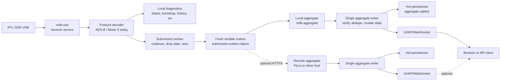
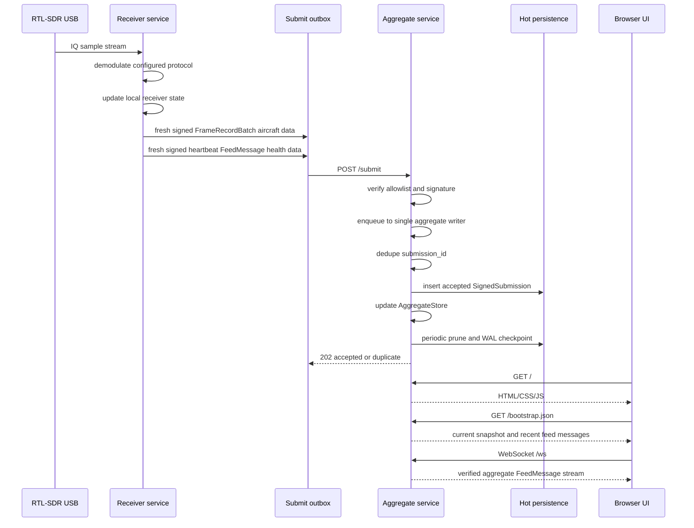

# Architecture

RSDB splits hardware collection from public serving.

`rsdb-usb` is the hardware-adjacent receiver process. It opens the RTL-SDR,
runs 1 configured radio job, maintains local receiver diagnostics, signs raw
frame batches and heartbeat messages when a receiver seed is configured, and
retries fresh submissions through a durable local outbox.

`rsdb-aggregate` is the public data product. It verifies signed submissions,
dedupes by submission ID, owns aggregate state through a single writer, persists
hot state, and serves the browser UI plus HTTP/WebSocket APIs.

## Component Diagram



```text
RTL-SDR USB
    |
    v
rsdb-usb
    role: receiver diagnostics and radio decode
    bind: usually 127.0.0.1:8080
    radio: 1 configured protocol per RTL-SDR dongle
    |
    +-- local diagnostics API
    |
    +-- signed FrameRecordBatch aircraft data
    +-- signed heartbeat FeedMessage health data
           |
           v
       submission worker
           coalesce -> drop stale -> sign -> append durable outbox -> retry POST
           |
           +-- http://127.0.0.1:8090/submit
           +-- https://remote-aggregate.example.com/submit

rsdb-aggregate
    role: public UI/API/WebSocket
    bind: usually 0.0.0.0:8090 on Pi, 0.0.0.0:$PORT on Fly.io
    |
    +-- verify allowlist and signature
    +-- dedupe submission_id
    +-- maintain receiver-scoped aircraft state
    +-- insert accepted submissions into SQLite
    +-- periodically prune by age and hot size
    |
    +-- public HTTP and WebSocket API
```

## Runtime Call Flow



```text
1. USB sends I/Q samples to rsdb-usb.
2. The receiver decodes the configured protocol into protocol-tagged feed updates and frame records.
3. The receiver updates its local diagnostic state.
4. The submission worker coalesces frame batches, measures payload lag, and drops rows older than the live freshness window.
5. The worker signs frame batches for aircraft data and heartbeat messages for receiver health.
6. The worker appends fresh submissions to the durable outbox.
7. The worker POSTs queued submissions to each configured aggregate `/submit`.
8. The aggregate verifies the allowlist and signature.
9. The HTTP worker queues the verified submission to the single writer.
10. The writer dedupes `submission_id` and inserts accepted submissions into SQLite.
11. The writer decodes frame batches into receiver-scoped state and broadcasts live FeedMessage updates.
12. Browser/API clients bootstrap from HTTP JSON, then use WebSocket for live updates.
```

## Protocol Boundary

The live protocol registry currently routes ADS-B / Mode S 1090ES to the
implemented decoder. The project recognizes `uat978`, `acars`, `vdl2`, and
`ais` as radio job keys so defaults can be configured and tested, but live
decoding for those protocols still needs to be built.

Frame replay and raw I/Q capture records are protocol-scoped. Future decoder
fixtures have to name their protocol instead of silently falling through as
ADS-B.

## Persistence Model

Receiver persistence is local diagnostic history:

```text
feed.ndjson
feed.previous.ndjson
latest-aircraft.json
```

Aggregate persistence is hot serving state:

```text
aggregate.sqlite3
aggregate.sqlite3-wal
aggregate.sqlite3-shm
```

The aggregate keeps current serving state in memory. Accepted submissions are
queued through 1 writer, inserted into SQLite, and periodically pruned by age
and configured hot size. The hot size limit tracks logical submission bytes;
SQLite reuses freed pages and attempts incremental vacuuming after prune work.
The aggregate keeps hot serving state only; evicted hot submissions are
intentionally removed from local storage. Cold export can be added later.

## Trust Model

Receiver trust is key-based: private seeds stay on receiver nodes, public keys
go into aggregate allowlists, and `submission_id` provides idempotent replay.
See [DEPLOYMENT.md](DEPLOYMENT.md) for onboarding and [API.md](API.md) for the
submission contract.
