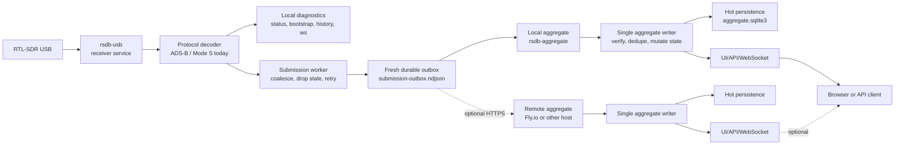
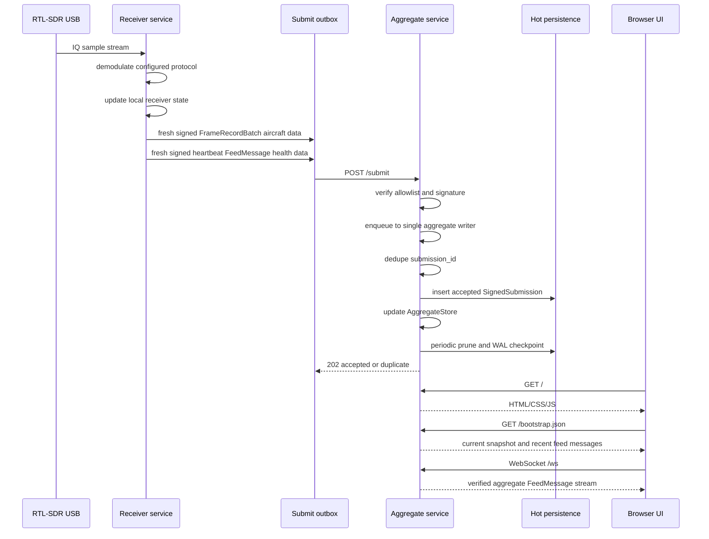

# RSDB Agent Guide

Generated by `bun run build:agents` from committed repo files. Do not edit `web/static/agents.md` directly.

Source repository: https://github.com/abhay/rsdb
Live aggregate: https://rsdb.hackshare.com
Live agent guide: https://rsdb.hackshare.com/agents.md

## Quick Context

RSDB is a Rust ADS-B / Mode S receiver stack. Raspberry Pi receiver nodes run
`rsdb-usb` next to an RTL-SDR and submit signed frame batches to
`rsdb-aggregate`. The aggregate verifies allowlisted Ed25519 public keys,
dedupes by `submission_id`, persists hot state in SQLite, and serves the public
browser UI plus JSON/WebSocket APIs.

## Common Tasks

### Join The Shared Aggregate

Create a local receiver seed, then open a PR adding only the public key to
`deploy/fly/allowlist.txt`:

```sh
RSDB_RECEIVER_LAT=37.753 RSDB_RECEIVER_LON=-122.447 ./pi/init-receiver-node.sh https://rsdb.hackshare.com
```

After the allowlist PR is deployed, provision a receiver-profile Pi from
nightly artifacts:

```sh
RSDB_NODE_PROFILE=receiver RSDB_RELEASE_CHANNEL=nightly ./pi/push-and-provision.sh
```

### Install A Release Directly On A Pi

```sh
./pi/install-release.sh receiver
RSDB_RELEASE_CHANNEL=nightly ./pi/install-release.sh receiver
./pi/install-release.sh receiver --enable-updater
```

Use `full` instead of `receiver` when the Pi should also run the local
aggregate UI/API.

### Deploy The Shared Fly Aggregate

Fly deployment is manual:

```sh
fly deploy
```

## Live Endpoints

- UI: https://rsdb.hackshare.com/
- Status: https://rsdb.hackshare.com/status.json
- Bootstrap: https://rsdb.hackshare.com/bootstrap.json
- Aircraft: https://rsdb.hackshare.com/aircraft.json
- Receivers: https://rsdb.hackshare.com/receivers.json
- Schema: https://rsdb.hackshare.com/schema.json
- Agent guide: https://rsdb.hackshare.com/agents.md
- Agent guide alias: https://rsdb.hackshare.com/llms.txt
- Crawler policy: https://rsdb.hackshare.com/robots.txt
- WebSocket: wss://rsdb.hackshare.com/ws

## Source Map

- `docs/AGENT_GUIDE.md`: Curated top-level guide, common tasks, live
  endpoints, and this source map.
- `pi/README.md`: Raspberry Pi flashing, provisioning, profiles, release
  installs, updater, and smoke checks.
- `docs/DEPLOYMENT.md`: Fly deployment, multi-receiver onboarding, and
  aggregate forwarding.
- `docs/CONFIGURATION.md`: Runtime environment keys and release-channel
  selection.
- `docs/API.md`: Public aggregate and local receiver diagnostics endpoints.
- `docs/ARCHITECTURE.md`: Component and data-flow overview.
- `AGENTS.md`: Repository agent rules.

## Compiled Reference

The following sections are copied from committed repo docs. Source headings
are nested under this generated guide so the page keeps one readable outline.

## Project README

Source: `README.md`

### RSDB

RSDB is a Rust ADS-B / Mode S receiver stack for RTL-SDR dongles. It has 2
pieces: a small receiver process that reads USB I/Q samples, and an aggregate
service that verifies signed receiver submissions, persists recent state, and
serves the browser UI plus JSON/WebSocket APIs.

The live decoder today is ADS-B / Mode S on 1090 MHz. The codebase already
models protocol-specific radio jobs for future UAT 978, ACARS, VDL2, and AIS
work, but those live decoders still need to be built.

#### What Runs Where

| Binary | Role | Typical host |
| --- | --- | --- |
| `rsdb-usb` | Opens the RTL-SDR, decodes the configured radio stream, signs frame batches and heartbeats, and serves local receiver diagnostics. | Raspberry Pi attached to the SDR |
| `rsdb-aggregate` | Verifies signed submissions, dedupes by submission ID, persists hot aggregate state, and serves the public UI/API/WebSocket feed. | Same Pi, Fly.io, or another server |

On a single Pi, both binaries run as managed services. The receiver submits to
the local aggregate at `http://127.0.0.1:8090`; it can also forward to remote
aggregates over HTTPS.

#### Quick Start For Development

Install Rust and Bun, then run:

```sh
bun install
bun run check
```

Build the deployable binaries:

```sh
cargo build --release -p rsdb-usb --bin rsdb-usb
cargo build --release -p rsdb-aggregate --bin rsdb-aggregate
```

Common local commands:

```sh
./target/release/rsdb-usb list
./target/release/rsdb-usb open 0
./target/release/rsdb-usb decode 0 30
./target/release/rsdb-usb json 0 30
./target/release/rsdb-aggregate serve allowlist.txt 127.0.0.1 8090
```

#### Raspberry Pi Receiver

The hardware path keeps the USB SDR off your laptop and puts it on a Raspberry
Pi receiver node. Pi onboarding installs prebuilt ARM64 release artifacts
instead of compiling Rust on-device. See [pi/README.md](pi/README.md) for the
CLI-only flash, first-boot, and provisioning flow.

To join the shared aggregate, see
[Multi-Receiver Onboarding](docs/DEPLOYMENT.md#multi-receiver-onboarding).

#### Aggregate Deployment

The aggregate can run on the Pi for local viewing, or as a standalone service
on Fly.io or another container host. The Docker image builds only
`rsdb-aggregate`. This repo's shared aggregate is served at
`https://rsdb.hackshare.com`.

See [docs/DEPLOYMENT.md](docs/DEPLOYMENT.md) for Fly.io and multi-receiver
setup.

#### Data Product

See [docs/API.md](docs/API.md) for the aggregate HTTP endpoints, WebSocket feed,
receiver diagnostics endpoints, and replay file formats.

The deployed aggregate also serves an agent-facing project guide at
`/agents.md`, generated from the committed repo docs and agent rules. The same
guide is available at `/llms.txt`, and `/robots.txt` allows those read-only
agent endpoints while disallowing `/submit`.

#### Architecture

The short version:

```text
RTL-SDR USB -> rsdb-usb -> signed submissions -> rsdb-aggregate -> UI/API/WS
```

See [docs/ARCHITECTURE.md](docs/ARCHITECTURE.md) for the component and call
flow diagrams.

#### Configuration

Runtime config comes from environment files. Scripts load `.env`; services load
`/etc/rsdb/rsdb.env`; both binaries also support `--config path` and
`RSDB_CONFIG`.

See [docs/CONFIGURATION.md](docs/CONFIGURATION.md) and [.env.example](.env.example).

#### Repository Hygiene

Before pushing:

```sh
bun run check
git status --short
```

Ignored local paths include `.env`, `target/`, `node_modules/`, `web/dist/`,
`pi/images/`, `pi/backups/`, and `pi/secrets/`.

#### License

Apache-2.0. See [LICENSE](LICENSE).

---

## Raspberry Pi Setup

Source: `pi/README.md`

### Raspberry Pi Receiver Setup

Use this CLI flow to build a Raspberry Pi receiver node. The RTL-SDR plugs into
the Pi instead of your laptop.

Release installs use prebuilt ARM64 artifacts from GitHub Releases. They do not
compile Rust on the Pi.

#### Profiles

Choose one Pi profile:

```text
receiver   rsdb.service only; submits to a remote aggregate
full       rsdb.service plus rsdb-aggregate.service for local UI/API
```

Use `receiver` for Pi 3-class nodes. Use `full` for Pi 4-class nodes or any Pi
that should host its own local aggregate.

#### Local Settings

Copy the example config and fill in `RSDB_RECEIVER_LAT` and
`RSDB_RECEIVER_LON`:

```sh
cp .env.example .env
```

Set `RSDB_NODE_PROFILE` when the default `full` profile is not right:

```sh
RSDB_NODE_PROFILE='receiver'
```

Then create the receiver identity locally:

```sh
./pi/init-receiver-node.sh
```

The init script creates `pi/secrets/receiver.seed`, updates `.env`, and prints
the public key to add to `deploy/fly/allowlist.txt` in a PR.

Add Wi-Fi fields only when the Pi can't use Ethernet or another preconfigured
network.

#### Create A Node SSH Key

```sh
./pi/create-node-ssh-key.sh
```

The private key lands under `pi/secrets/`, which git ignores.

#### Flash Raspberry Pi OS Lite

Download the current Raspberry Pi OS Lite 64-bit image:

```sh
./pi/download-rpios-lite.sh
```

List removable disks:

```sh
./pi/list-disks-macos.sh
```

Flash the SD card and inject first-boot SSH, hostname, mDNS, and optional Wi-Fi
configuration:

```sh
./pi/flash-rpios-lite-macos.sh
./pi/flash-rpios-lite-macos.sh /dev/diskN
```

The flash script erases the selected disk and requires typed confirmation. If
there is exactly 1 external physical disk, it can auto-select it.

After boot, give the Pi a few minutes. First boot applies config and reboots
once.

#### Connect

Load the script environment and derive local targets:

```sh
RSDB_SCRIPT_DIR="$PWD/pi"
. ./pi/load-env.sh
node_target="$RSDB_NODE_USER@$RSDB_NODE_HOST"
node_service_url="http://$RSDB_NODE_HOST:$RSDB_AGGREGATE_PORT"
```

SSH:

```sh
ssh -i "$RSDB_NODE_SSH_KEY" -o ForwardAgent=no "$node_target"
```

If mDNS doesn't resolve, check that your network allows client-to-client
discovery:

```sh
dns-sd -G v4 "$RSDB_NODE_HOSTNAME.local"
dns-sd -B _ssh._tcp local
```

Guest networks often block mDNS. In that case, set `RSDB_NODE_HOST` to the
Pi's LAN or VPN IP.

#### Provision

From this repo on the laptop:

```sh
./pi/push-and-provision.sh
```

Provisioning:

- installs OS packages needed for a release-installed node
- installs RTL-SDR udev rules
- copies the local receiver seed to `/etc/rsdb/receiver.seed`
- downloads the selected ARM64 release artifact and `checksums.txt`
- verifies SHA-256 before installing
- installs to `/opt/rsdb/releases/<version>`
- atomically updates `/opt/rsdb/current`
- writes `/etc/rsdb/rsdb.env` if missing and preserves existing config
- installs systemd units that run `/opt/rsdb/current/bin/...`

Existing `/etc/rsdb/rsdb.env`, `/etc/rsdb/receiver.seed`, and
`/etc/rsdb/allowlist.txt` files are preserved.

Release selection defaults to the latest tagged release:

```sh
RSDB_RELEASE_CHANNEL=nightly ./pi/push-and-provision.sh
RSDB_VERSION=v0.1.0 ./pi/push-and-provision.sh
```

To run the installer directly on a Pi that already has this repo:

```sh
./pi/install-release.sh receiver
./pi/install-release.sh full
RSDB_RELEASE_CHANNEL=nightly ./pi/install-release.sh receiver
RSDB_VERSION=v0.1.0 ./pi/install-release.sh full
```

Reboot after the first provision so group membership is fully active:

```sh
ssh -i "$RSDB_NODE_SSH_KEY" -o ForwardAgent=no "$node_target" sudo reboot
```

#### Updater

Auto-update is opt-in:

```sh
./pi/install-release.sh receiver --enable-updater
./pi/install-release.sh full --enable-updater
```

The updater installs `rsdb-update.service` and `rsdb-update.timer`. The timer
runs daily, reuses the selected profile and release channel from
`/etc/rsdb/rsdb.env`, and restarts services only when the installed release
version changes.

Previous release directories remain under `/opt/rsdb/releases/` for manual
rollback. To roll back, repoint `/opt/rsdb/current` to the previous release
directory and restart the affected services.

#### Test The SDR

Plug the RTL-SDR into the Pi.

```sh
ssh -i "$RSDB_NODE_SSH_KEY" -o ForwardAgent=no "$node_target"
/opt/rsdb/current/bin/rsdb-usb list
/opt/rsdb/current/bin/rsdb-usb open 0
/opt/rsdb/current/bin/rsdb-usb decode 0 30
```

Stream newline-delimited feed JSON for a bounded test:

```sh
/opt/rsdb/current/bin/rsdb-usb json 0 30
```

Record lower-level decoded frame records:

```sh
/opt/rsdb/current/bin/rsdb-usb record-frames 30 /tmp/rsdb-frames.ndjson
/opt/rsdb/current/bin/rsdb-usb replay-frames /tmp/rsdb-frames.ndjson
```

#### Open The UI

The `full` profile serves the browser UI from the local aggregate:

```text
$node_service_url
```

If DNS is unavailable:

```text
http://<node-ip>:8090
```

Useful API checks from the laptop for the `full` profile:

```sh
curl -fsS "$node_service_url/status.json"
curl -fsS "$node_service_url/receivers.json"
curl -fsS "$node_service_url/aircraft.json"
curl -fsS "$node_service_url/bootstrap.json"
curl -fsS "$node_service_url/schema.json"
```

Useful checks on the Pi:

```sh
systemctl status rsdb.service
journalctl -u rsdb.service -f
systemctl status rsdb-aggregate.service
journalctl -u rsdb-aggregate.service -f
curl -fsS http://127.0.0.1:8080/status.json
curl -fsS http://127.0.0.1:8090/status.json
```

For `receiver` profile nodes, `rsdb-aggregate.service` is disabled and only the
receiver diagnostics endpoint is local.

#### Fly.io

Fly deploys are still manual:

```sh
fly deploy
```

Do not expect the GitHub release workflow to deploy Fly. Revisit that after Pi
release installs and the opt-in updater are proven.

#### Next References

- [Configuration](../docs/CONFIGURATION.md) covers `.env`, `/etc/rsdb/rsdb.env`,
  receiver coordinates, signing, and persistence.
- [Deployment](../docs/DEPLOYMENT.md) covers Fly.io, allowlists, and adding
  another receiver.
- [API](../docs/API.md) covers aggregate and diagnostics endpoints.

---

## API Contract

Source: `docs/API.md`

### API

The aggregate owns the public API. The receiver diagnostics API stays local to
the receiver node.

#### Aggregate HTTP Endpoints

```text
GET  /                 Browser UI
GET  /status.json      Aggregate health, receiver summaries, ingest counters
GET  /aircraft.json    Receiver-scoped aggregate aircraft snapshot
GET  /bootstrap.json   Current snapshot plus recent feed messages
GET  /receivers.json   Receiver summaries
GET  /schema.json      Machine-readable endpoint and field contract
GET  /agents.md        Agent-facing project guide generated from repo docs
GET  /llms.txt         Same guide for clients that discover llms.txt
GET  /robots.txt       Crawler policy for safe read-only endpoints
GET  /ws               WebSocket stream of verified FeedMessage values
POST /submit           SignedSubmission ingest endpoint
```

`POST /submit` accepts 1 JSON `SignedSubmission`. Its `payload` may be a
`FeedMessage` or a `FrameRecordBatch`. The aggregate checks the receiver public
key allowlist, verifies the Ed25519 signature, validates the payload, checks the
signed `submission_id`, dedupes by that ID, and returns `202` for accepted or
duplicate submissions.

Signed frame-record batches stay JSON on the wire. They are larger than a
binary stream, but they keep submission logs inspectable, curl-friendly, and easy
to replay. Binary receiver formats should be adapters that produce signed JSON
submissions.

Live receivers submit aircraft data as signed `FrameRecordBatch` payloads. They
still submit heartbeat `FeedMessage` payloads so aggregates can show receiver
health, USB counters, receiver site, and submission outbox state.

#### Receiver Diagnostics Endpoints

When `rsdb-usb serve` is running locally:

```text
GET /status.json       Receiver/radio health
GET /aircraft.json     Current receiver aircraft snapshot
GET /bootstrap.json    Current snapshot plus recent feed messages
GET /schema.json       Machine-readable receiver API contract
GET /history.ndjson    Recent persisted feed messages, when persistence is enabled
GET /ws                Local receiver FeedMessage stream
```

The Pi setup binds this service to `127.0.0.1:8080` by default. The aggregate
serves the UI and public API.

#### Feed Messages

Feed messages are versioned JSON with `schema_version: 1` and a protocol field.
Current message types:

```text
snapshot
aircraft
stale_aircraft
heartbeat
```

Every message may include receiver identity. Receiver handles are described in
[CONFIGURATION.md](CONFIGURATION.md).

#### Bootstrap Then Stream

Browser and API clients should:

1. Fetch `/bootstrap.json`.
2. Render the current snapshot and recent feed messages.
3. Connect to `/ws`.
4. Apply live `FeedMessage` updates.

That gives clients enough recent history to draw trails before live updates
arrive.

#### CLI Replay Formats

Feed replay uses newline-delimited `FeedMessage` JSON:

```sh
./target/release/rsdb-usb replay /tmp/rsdb-feed.ndjson
```

Frame replay uses newline-delimited decoded Mode S `FrameRecord` JSON:

```sh
./target/release/rsdb-usb record-frames 30 /tmp/rsdb-frames.ndjson
./target/release/rsdb-usb replay-frames /tmp/rsdb-frames.ndjson
```

Frame records include:

```text
schema_version
protocol
now_ms
sample_index
frame_sequence
stream_start_ms
rx_elapsed_ns
rx_timestamp_uncertainty_ns_estimate
receiver
receiver_site
center_frequency_hz
sample_rate_hz
gain_mode
gain_tenth_db
bias_t
device_index
tuner_name
stream_id
chunk_sequence
chunk_sample_index
dropped_samples_before
clipped_sample_ratio
dc_i_offset
dc_q_offset
signal.signal_power
signal.noise_power
signal.signal_dbfs_estimate
signal.snr_db_estimate
signal.chunk_noise_power
signal.beast_signal_level
signal.preamble_high_avg
signal.preamble_low_avg
signal.preamble_delta
signal.bit_margin_min
signal.bit_margin_mean
icao
adsb_type_code
raw
downlink_format
bit_len
crc_valid
```

Signal fields are relative estimates from the RTL-SDR sample stream, not
calibrated RF power measurements.

Frame records are validated before replay. The validator rejects unsupported
schema or protocol values, malformed raw frames, frame metadata that disagrees
with `raw`, impossible radio/timing values, invalid signal fields, and sequence
regressions within a stream.

#### Signed Frame Batches

Raw-frame submissions wrap multiple decoded records under one receiver:

```json
{
  "schema_version": 1,
  "submission_id": "...",
  "receiver_id": "ed25519-...",
  "algorithm": "ed25519",
  "submitted_at_ms": 1780891560000,
  "payload": {
    "schema_version": 1,
    "protocol": "adsb1090",
    "receiver": {
      "id": "ed25519-..."
    },
    "records": [
      {
        "schema_version": 2,
        "protocol": "adsb1090",
        "now_ms": 1780891560000,
        "sample_index": 0,
        "center_frequency_hz": 1090000000,
        "sample_rate_hz": 2000000,
        "raw": "8DA062EF9910B19A38040ACE2B14",
        "downlink_format": 17,
        "bit_len": 112,
        "crc_valid": true
      }
    ]
  },
  "signature": "..."
}
```

The aggregate validates the batch schema, receiver ID, protocol, record
metadata, and sequence fields before inserting the accepted submission into
SQLite.
It keeps decoder state per receiver, so frame records split across submissions
can still combine into aircraft positions. Decoded aircraft updates from the
batch are broadcast as normal `FeedMessage` values on `/ws`.

---

## Architecture

Source: `docs/ARCHITECTURE.md`

### Architecture

RSDB splits hardware collection from public serving.

`rsdb-usb` is the hardware-adjacent receiver process. It opens the RTL-SDR,
runs 1 configured radio job, maintains local receiver diagnostics, signs raw
frame batches and heartbeat messages when a receiver seed is configured, and
retries fresh submissions through a durable local outbox.

`rsdb-aggregate` is the public data product. It verifies signed submissions,
dedupes by submission ID, owns aggregate state through a single writer, persists
hot state, and serves the browser UI plus HTTP/WebSocket APIs.

#### Component Diagram



```text
RTL-SDR USB
    |
    v
rsdb-usb
    role: receiver diagnostics and radio decode
    bind: usually 127.0.0.1:8080
    radio: 1 configured protocol per RTL-SDR dongle
    |
    +-- local diagnostics API
    |
    +-- signed FrameRecordBatch aircraft data
    +-- signed heartbeat FeedMessage health data
           |
           v
       submission worker
           coalesce -> drop stale -> sign -> append durable outbox -> retry POST
           |
           +-- http://127.0.0.1:8090/submit
           +-- https://remote-aggregate.example.com/submit

rsdb-aggregate
    role: public UI/API/WebSocket
    bind: usually 0.0.0.0:8090 on Pi, 0.0.0.0:$PORT on Fly.io
    |
    +-- verify allowlist and signature
    +-- dedupe submission_id
    +-- maintain receiver-scoped aircraft state
    +-- insert accepted submissions into SQLite
    +-- periodically prune by age and hot size
    |
    +-- public HTTP and WebSocket API
```

#### Runtime Call Flow



```text
1. USB sends I/Q samples to rsdb-usb.
2. The receiver decodes the configured protocol into protocol-tagged feed updates and frame records.
3. The receiver updates its local diagnostic state.
4. The submission worker coalesces frame batches, measures payload lag, and drops rows older than the live freshness window.
5. The worker signs frame batches for aircraft data and heartbeat messages for receiver health.
6. The worker appends fresh submissions to the durable outbox.
7. The worker POSTs queued submissions to each configured aggregate `/submit`.
8. The aggregate verifies the allowlist and signature.
9. The HTTP worker queues the verified submission to the single writer.
10. The writer dedupes `submission_id` and inserts accepted submissions into SQLite.
11. The writer decodes frame batches into receiver-scoped state and broadcasts live FeedMessage updates.
12. Browser/API clients bootstrap from HTTP JSON, then use WebSocket for live updates.
```

#### Protocol Boundary

The live protocol registry currently routes ADS-B / Mode S 1090ES to the
implemented decoder. The project recognizes `uat978`, `acars`, `vdl2`, and
`ais` as radio job keys so defaults can be configured and tested, but live
decoding for those protocols still needs to be built.

Frame replay and raw I/Q capture records are protocol-scoped. Future decoder
fixtures have to name their protocol instead of silently falling through as
ADS-B.

#### Persistence Model

Receiver persistence is local diagnostic history:

```text
feed.ndjson
feed.previous.ndjson
latest-aircraft.json
```

Aggregate persistence is hot serving state:

```text
aggregate.sqlite3
aggregate.sqlite3-wal
aggregate.sqlite3-shm
```

The aggregate keeps current serving state in memory. Accepted submissions are
queued through 1 writer, inserted into SQLite, and periodically pruned by age
and configured hot size. The hot size limit tracks logical submission bytes;
SQLite reuses freed pages and attempts incremental vacuuming after prune work.
The aggregate keeps hot serving state only; evicted hot submissions are
intentionally removed from local storage. Cold export can be added later.

#### Trust Model

Receiver trust is key-based: private seeds stay on receiver nodes, public keys
go into aggregate allowlists, and `submission_id` provides idempotent replay.
See [DEPLOYMENT.md](DEPLOYMENT.md) for onboarding and [API.md](API.md) for the
submission contract.

---

## Configuration

Source: `docs/CONFIGURATION.md`

### Configuration

RSDB uses shell-style environment files.

| Context | Config source |
| --- | --- |
| Local scripts | `.env` in the repo root |
| Pi services | `/etc/rsdb/rsdb.env` |
| Explicit binary override | `--config path` |
| Shared binary override | `RSDB_CONFIG=path` |

Copy [.env.example](../.env.example) to `.env` for local receiver work.

#### Release Install

Release-installed Pi nodes run binaries through `/opt/rsdb/current/bin/...`.
The installer writes these settings to `/etc/rsdb/rsdb.env`:

```sh
RSDB_NODE_PROFILE=receiver
RSDB_RELEASE_CHANNEL=stable
RSDB_VERSION=latest
```

`RSDB_NODE_PROFILE=receiver` enables only `rsdb.service` and submits to a
remote aggregate. `RSDB_NODE_PROFILE=full` enables both `rsdb.service` and
`rsdb-aggregate.service`, and ensures the local aggregate URL is in
`RSDB_SUBMIT_URLS`.

`RSDB_RELEASE_CHANNEL=stable` with `RSDB_VERSION=latest` installs the latest
tagged release. Set `RSDB_RELEASE_CHANNEL=nightly` for the prerelease channel,
or set `RSDB_VERSION=vX.Y.Z` for an exact tag.

#### Required Local Receiver Fields

```sh
RSDB_NODE_HOSTNAME='rsdb-your-node'
RSDB_RECEIVER_LAT='37.753'
RSDB_RECEIVER_LON='-122.447'
```

`RSDB_NODE_HOSTNAME` is used for first boot and mDNS. Scripts default to
`<RSDB_NODE_HOSTNAME>.local`. Set `RSDB_NODE_HOST` only when scripts should use
a LAN, VPN, static IP, or DNS name directly.

Receiver coordinates are required. They drive range and bearing calculations.
Use a nearby generic location if you don't want to expose exact receiver
position.

#### Laptop And First-Boot Fields

```sh
RSDB_NODE_USER='rsdb'
RSDB_NODE_HOST=''
RSDB_NODE_SSH_KEY='pi/secrets/rsdb_node_ed25519'
RSDB_TIMEZONE='America/Los_Angeles'
RSDB_WIFI_COUNTRY='US'
RSDB_WIFI_SSID='your-network'
RSDB_WIFI_PASSWORD='your-password'
```

Wi-Fi fields are only needed when the Pi cannot use Ethernet or another
preconfigured network. The flash script writes Wi-Fi credentials into the boot
partition first-run script; that script removes itself after first boot.

#### Receiver Radio

```sh
RSDB_DEVICE_INDEX=0
RSDB_PROTOCOL=adsb1090
RSDB_CENTER_FREQUENCY_HZ=1090000000
RSDB_SAMPLE_RATE_HZ=2000000
RSDB_GAIN=496
RSDB_BIAS_T=false
```

`RSDB_PROTOCOL=adsb1090` is the only implemented live decoder today. Recognized
future protocol keys are `uat978`, `acars`, `vdl2`, and `ais`. Center frequency
and sample rate default from the protocol and only need to be set for overrides.

1 RTL-SDR dongle runs 1 radio job at a time. Simultaneous protocols need
multiple dongles or a different SDR.

#### Receiver Service

```sh
RSDB_COLLECTOR_PORT=8080
RSDB_STALE_AFTER_SECONDS=60
RSDB_HEARTBEAT_SECONDS=15
RSDB_RETRY_SECONDS=10
RSDB_PERSIST_DIR=/var/lib/rsdb
RSDB_PERSIST_FEED_MAX_MB=100
```

`rsdb-usb serve` keeps the diagnostics listener running even when the USB
receiver is missing. It reports the error, emits heartbeats, and retries.

#### Signing And Submission

```sh
RSDB_RECEIVER_SEED_PATH=pi/secrets/receiver.seed
RSDB_SIGNING_KEY_PATH=/etc/rsdb/receiver.seed
RSDB_SUBMIT_URLS=http://127.0.0.1:8090
RSDB_SUBMIT_RETRY_SECONDS=5
RSDB_SUBMIT_MAX_LAG_SECONDS=60
RSDB_SUBMIT_OUTBOX_DIR=/var/lib/rsdb/submit
RSDB_SUBMIT_OUTBOX_MAX_MB=25
```

Receiver identity is derived from the Ed25519 seed. Add remote/shared
aggregates to `RSDB_SUBMIT_URLS` as a comma or whitespace separated list:

```sh
RSDB_SUBMIT_URLS='http://127.0.0.1:8090,https://rsdb.hackshare.com'
```

`RSDB_REMOTE_AGGREGATE_URLS` is an installer helper used when deriving profile
defaults. The `receiver` profile uses it as the submit target when
`RSDB_SUBMIT_URLS` is not already configured. The `full` profile appends it to
the local aggregate URL when present.

The outbox is durable, but the live feed has a freshness limit. If an aggregate
is unavailable or the sender falls behind, payloads older than
`RSDB_SUBMIT_MAX_LAG_SECONDS` are dropped instead of being replayed as live
traffic. Submission IDs make retry idempotent at the aggregate. Aircraft data is
submitted as signed frame batches; receiver health is submitted as signed
heartbeat feed messages.

`RSDB_RECEIVER_SEED_PATH` is a laptop-side deploy helper created by
`pi/init-receiver-node.sh`. `pi/push-and-provision.sh` installs that local seed to
`/etc/rsdb/receiver.seed` before provisioning the Pi. Runtime services use
`RSDB_SIGNING_KEY_PATH` on the Pi.

#### Aggregate Service

```sh
RSDB_AGGREGATE_HOST=0.0.0.0
RSDB_AGGREGATE_PORT=8090
RSDB_ALLOWLIST=/etc/rsdb/allowlist.txt
RSDB_AGGREGATE_DATA_DIR=/var/lib/rsdb/aggregate
RSDB_AGGREGATE_RETENTION_HOURS=72
RSDB_AGGREGATE_HOT_MAX_MB=250
```

`RSDB_ALLOWLIST` can be a path or an inline list of public Ed25519 keys. Public
allowlists can live in repo config or environment variables.

`RSDB_AGGREGATE_DATA_DIR` stores the aggregate SQLite database. The retention
window and hot max control how many accepted submissions remain in hot storage;
the max is measured against the logical JSON submission bytes stored in SQLite.
After pruning, SQLite reuses freed pages and attempts incremental vacuuming.

`PORT` is treated as `RSDB_AGGREGATE_PORT` when `RSDB_AGGREGATE_PORT` is not
set, which is useful on container platforms.

#### Generated Receiver Handles

The UI derives a 3-word handle from the key-derived receiver ID. A short
hex suffix exists for collision handling, but normal UI surfaces should hide it
unless 2 receivers in the same dataset collide.

---

## Deployment

Source: `docs/DEPLOYMENT.md`

### Deployment

#### Raspberry Pi Receiver

Use [pi/README.md](../pi/README.md) for the CLI-only Pi setup.

Release-installed Pi nodes use prebuilt ARM64 GitHub Release artifacts and do
not compile Rust on-device. Choose a profile:

```text
receiver   rsdb.service only; submits to a remote aggregate
full       rsdb.service plus rsdb-aggregate.service for local UI/API
```

Install commands:

```sh
./pi/install-release.sh receiver
./pi/install-release.sh full
RSDB_RELEASE_CHANNEL=nightly ./pi/install-release.sh receiver
RSDB_VERSION=v0.1.0 ./pi/install-release.sh full
./pi/install-release.sh receiver --enable-updater
```

From a laptop that has already followed the receiver onboarding flow, provision
a Pi from the nightly channel with:

```sh
RSDB_NODE_PROFILE=receiver RSDB_RELEASE_CHANNEL=nightly ./pi/push-and-provision.sh
```

The receiver service is hardware-adjacent and normally binds diagnostics on
`127.0.0.1:8080`. The aggregate service verifies signed submissions and serves
the UI/API on `0.0.0.0:8090` when the `full` profile is installed.

Release installs put binaries under `/opt/rsdb/releases/<version>` and update
`/opt/rsdb/current` atomically. Systemd units execute
`/opt/rsdb/current/bin/rsdb-usb` and
`/opt/rsdb/current/bin/rsdb-aggregate`.

Useful checks on the Pi:

```sh
systemctl status rsdb.service
journalctl -u rsdb.service -f
systemctl status rsdb-aggregate.service
journalctl -u rsdb-aggregate.service -f
curl -fsS http://127.0.0.1:8090/status.json
```

#### Fly.io Aggregate

The repo includes an aggregate-only `Dockerfile` and
`deploy/fly/fly.toml.example`.

Create `fly.toml` from the example, update the app name and region, then create
a volume for hot aggregate state:

```sh
fly volumes create rsdb_data --size 1 --region sjc
```

Public receiver keys live in `deploy/fly/allowlist.txt`. Additions should come
through PRs so the public allowlist is reviewed with the code.

Deploy:

```sh
fly deploy
```

Fly deploys are still manual. The GitHub release workflow only publishes
Raspberry Pi release artifacts and the `nightly` prerelease channel.

The Fly service listens on internal port `8080`, serves HTTPS publicly, and
stores hot aggregate state under `/data/aggregate`. The Docker image copies
`deploy/fly/allowlist.txt` into `/etc/rsdb/allowlist.txt`.

The shared RSDB aggregate is deployed as `rsdb-aggregate` and is served at:

```text
https://rsdb.hackshare.com
```

The custom hostname is a DNS-only CNAME:

```text
rsdb.hackshare.com -> m1qe5xn.rsdb-aggregate.fly.dev
```

Check the certificate and endpoint after DNS changes:

```sh
fly certs check rsdb.hackshare.com --app rsdb-aggregate
curl -fsS https://rsdb.hackshare.com/status.json
```

#### Multi-Receiver Onboarding

Each receiver owner creates their own private seed locally and opens a PR with
only the public key:

```sh
RSDB_RECEIVER_LAT=37.753311 \
RSDB_RECEIVER_LON=-122.447029 \
./pi/init-receiver-node.sh https://rsdb.hackshare.com
```

The script writes ignored local files under `pi/secrets/`, updates the local
`.env`, and prints a 64-hex public key. The private seed never needs to leave
the receiver owner's machine.

Files:

```text
pi/secrets/receiver.seed         private Ed25519 signing seed
pi/secrets/allowlist-entry.txt   public Ed25519 key for the aggregate operator
```

Open a PR adding the public key to:

```text
deploy/fly/allowlist.txt
```

Maintainers can validate and sort additions with:

```sh
./pi/add-allowlisted-receiver.sh deploy/fly/allowlist.txt path/to/public-key-file
```

For Fly.io, merge the PR and redeploy.

For a Pi-hosted aggregate:

```sh
scp deploy/fly/allowlist.txt "$node_target:/tmp/allowlist.txt"
ssh "$node_target" 'sudo install -m 0644 /tmp/allowlist.txt /etc/rsdb/allowlist.txt && sudo systemctl restart rsdb-aggregate.service'
```

#### Local Aggregate Plus Remote Forwarding

Keep the Pi local aggregate in the submit target list:

```sh
RSDB_SUBMIT_URLS=http://127.0.0.1:8090
RSDB_SUBMIT_MAX_LAG_SECONDS=60
```

Add remote aggregates to the same list:

```sh
RSDB_SUBMIT_URLS=http://127.0.0.1:8090,https://rsdb.hackshare.com
```

The receiver tracks pending destinations per submission. A local aggregate can
drain while a remote aggregate stays queued for retry. Rows that age past
`RSDB_SUBMIT_MAX_LAG_SECONDS` are dropped before replay so the shared aggregate
does not ingest old data as live traffic.

---

## Repository Agent Rules

Source: `AGENTS.md`

### Agent Playbook

#### Joining A Receiver

Use [docs/DEPLOYMENT.md](docs/DEPLOYMENT.md#multi-receiver-onboarding) for the
receiver onboarding flow. Do not duplicate those steps here.

Do not commit or print private seeds, SSH private keys, Wi-Fi credentials, or
local `.env` contents.
